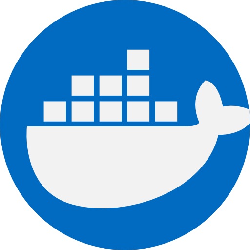
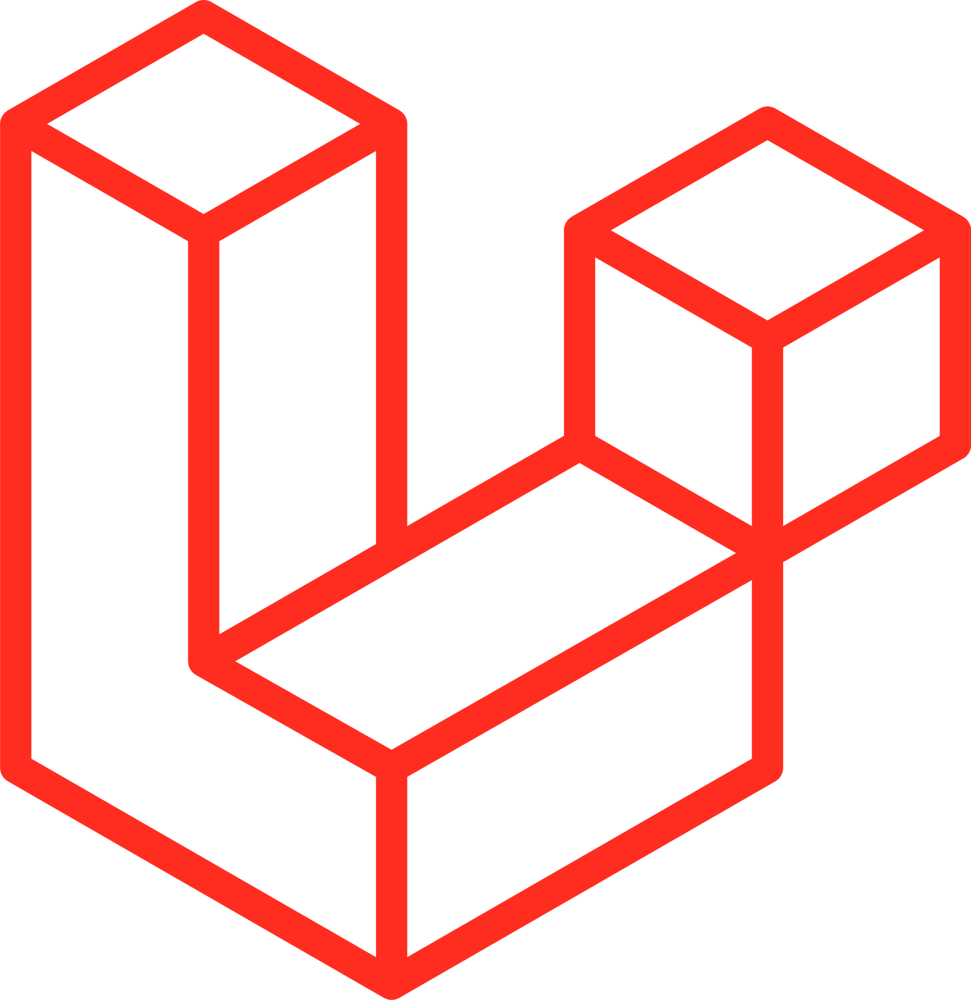
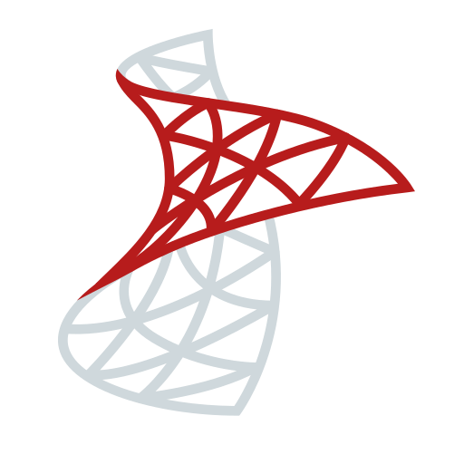

	<h1>
		Seja Bem vindo 👋, Sou o Ruan
		  
		Desenvolvedor Full Stack
		  
	</h1>

  

	<h1>💻 Stacks:</h1>
	

	 
	 
	 
	 
	 
	 
	 
	 
	 
	 
	 
	 
	 
	 
	 
	 
	 
	 
	 
	 
	

  

	<h1>🌐 Contato:</h1>
	

		
		
		 
	

  

	<h1>✅ GitHub Status:</h1>
	

		

  			
		

		

  			
  			

 
		

<h3 align="center">Contador de Visitas</h3>

 
	

